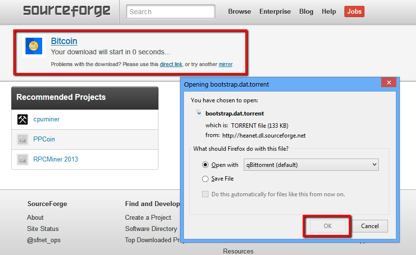

How to use a bootstrap file to speed up blockchain synchronization
==================================================================

The Anoncoin client will normally download the blockchain from the network by synching with the other clients. The blockchain will continue to grow with time. The first time that Anoncoin is run, full synchronization could take from several hours to more than a day. Fortunately, this process can be speeded up substantially by use of a bootstrap file.
=======
Normally the Anoncoin client will download the transaction and network information, called the blockchain, from the network by syncing with the other clients. This can be a process that can take multiple days as the Anoncoin block chain has grown, and is now more than 364 megabytes. Luckily there is a safe and fast way to speed up this process. We’ll show you how to bootstrap your blockchain to bring your client up to speed in just a few simple steps.

To use a bootstrap file to speed up initial network synchronization, follow these simple steps.

Download the bootstrap file
---------------------------

The official Anoncoin bootstrap file can be downloaded either from the [anoncoin.net](https://anoncoin.net/downloads/bootstrap/) web site or by the i2p BitTorrent port i2psnark (filename: anoncoin.bootstrap.tar.xz). The compressed file is currently about 100 Mb in size. After uncompressing the file, locate the file bootstrap.dat and verify its SHA1 and MD5 checksums and GPG detached signature.

Copy the bootstrap file to the Anoncoin data directory
-----------------------------------------------------

Before importing the bootstrap.dat file, you will need to copy it to the correct location on your computer. If you have never used the Anoncoin software before, please start it once and then exit to create the required data directories. If the data directories already exist, please ensure that the Anoncoin software is not running. 

Place the bootstrap.dat file into the Anoncoin data folder. The location of this folder depends upon your platform.
=======
	magnet:?xt=urn: TODO: [define here]

 or go to TODO: [define here] for a signed magnet link. Alternately you can use the [.torrent file] TODO: [define here]  found in our Github repository..

The download page should look like this, with a countdown to the download. If it does not work click the direct download link.

The torrent client installed will recognize the download of the torrent file. Save the bootstrap.dat file to a folder you use for downloads. The image below shows the torrent download in QBittorent, with current speed and ETA highlighted.

### Download the block chain directly from official repositories
The Bittorent version, see above, of the block chain download is refreshed more often than the direct download available. If Bittorent is blocked on your network then you can use the direct download method. Be sure to only use official repositories as the link displayed below. This download will only update the client to Febuary 14th, 2015.

Use https://github.com/Anoncoin/anoncoin-binaries to download or copy and paste the link below.

	TODO: [define here]

The download page should look like this, with a countdown to the download. If it does not work directly click the download. Save the file to a folder you use for downloads.

### Importing the blockchain
Exit the Anoncoin Client software if you have it running. Be sure not to have an actively used wallet in use. We are going to copy the download of the blockchain to the Anoncoin client data directory. You should run the client software at least once so it can generate the data directory. Copy the downloaded bootstrap.dat file into the Anoncoin data folder, after unarchiving it.  Compression saves allot of bandwidth, but requires that one extra step.

**For Windows users:**

Open explorer, and type into the address bar:

	%APPDATA%\Anoncoin

**For OSX users:**

Open the Finder by pressing [shift] + [cmd] + [g] and then enter:

	~/Library/Application Support/Anoncoin/

**For Linux users:**

The directory is hidden in your User folder. Go to:

	~/.anoncoin/

Import the blockchain
---------------------

To import the bootstrap file, simply start the Anoncoin client software. When the wallet appears, you should see the text "Importing blocks from disk" in the lower left corner of the wallet. This process should take about 20 minutes, and after this, the client will begin to download the most recent blocks that were not in the bootstrap.dat file.

Is this safe?
-------------

Yes, the above method is safe. The download contains only the raw blockchain data and the client verifies this when it is imported.
